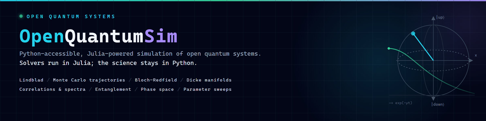
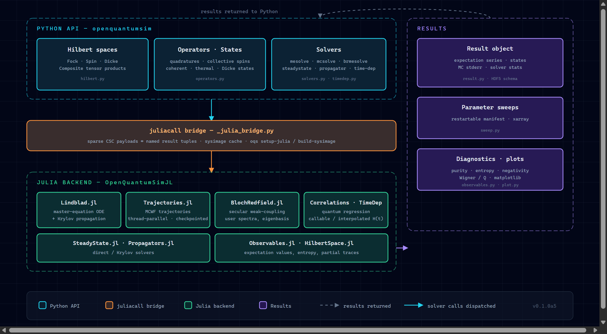

OpenQuantumSim
==============

OpenQuantumSim is a Python interface with a Julia backend for open quantum
system simulation. It is aimed at researchers who need Lindblad propagation,
Monte Carlo wave-function trajectories, Bloch-Redfield weak-coupling dynamics,
collective-spin/Dicke models, restartable sweeps, HDF5 outputs, and state
diagnostics without leaving the Python scientific stack.

- **One import, no glue code.** ``import openquantumsim as oqs`` gives the full
  API: spaces, operators, solvers, diagnostics, plotting, and persistence.
- **Julia speed, Python ergonomics.** Propagation runs in the packaged
  ``OpenQuantumSimJL`` backend; arrays go in, named results come back.
- **Validated, not just benchmarked.** Analytic limits and QuTiP reference
  models are checked in CI on Linux and Windows.

Get started with the :doc:`quickstart`, browse the :doc:`examples`, or jump
straight to the :doc:`api/index`. The package is currently an **alpha**: the
API is usable, tested, and published on PyPI, but minor interface changes may
still occur before a stable ``0.1`` release. The solver entry points, the
``Result`` object, and the HDF5 result schema are stable-in-practice; see the
README for the road to ``0.1.0``.

If you use OpenQuantumSim in your research, please cite the software release —
see the repository ``CITATION.cff``.

.. toctree::
   :maxdepth: 2
   :caption: Getting Started

   quickstart
   examples

.. toctree::
   :maxdepth: 2
   :caption: Reference

   api/index
   tutorials/index
   result_hdf5_schema

.. toctree::
   :maxdepth: 2
   :caption: Background

   theory/index
   validation
   performance
   case_studies
