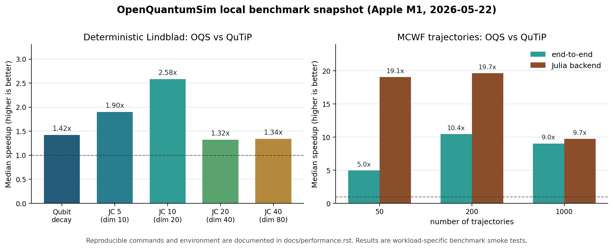

Performance Benchmarks
======================

This page records a reproducible OpenQuantumSim performance baseline. The
numbers below are not a universal leaderboard; they document one hardware and
software configuration so future benchmark results can be compared against the
same reference point.

Benchmark Environment
---------------------

.. list-table::
   :header-rows: 1

   * - Item
     - Value
   * - Date
     - 2026-05-22
   * - OpenQuantumSim commit
     - startup optimization snapshot
   * - CPU
     - Apple M1
   * - Logical CPU count
     - 8
   * - Platform
     - macOS 26.4.1 arm64
   * - Python
     - 3.14.3
   * - Julia backend runtime
     - 1.11.9 through JuliaCall
   * - ``julia --version``
     - 1.12.5
   * - OpenQuantumSim
     - 0.1.0a2
   * - QuTiP
     - 5.2.3
   * - NumPy / SciPy / h5py
     - 2.4.4 / 1.17.1 / 3.16.0

Deterministic Solver: OpenQuantumSim vs QuTiP
---------------------------------------------

Command:

.. code-block:: bash

   MPLCONFIGDIR=/private/tmp/oqs-mpl \
   python benchmarks/bench_vs_qutip.py \
       --repeats 5 \
       --time-points 81 \
       --t-final 6.0 \
       --cases qubit jc5 jc10 \
       --oqs-methods auto krylov ode \
       --json runs/benchmarks/bench_vs_qutip_after_stats.json

Settings: ``rtol=1e-8``, ``atol=1e-10``. OpenQuantumSim used the default
single-threaded backend process for this deterministic benchmark.

.. list-table::
   :header-rows: 1

   * - Case
     - Dimension
     - QuTiP median
     - OQS auto median
     - Best OQS median
     - OQS auto vs QuTiP
     - Max expectation delta
   * - Qubit decay
     - 2
     - 1.43 ms
     - 1.00 ms
     - 0.77 ms (``ode``)
     - 1.42x
     - 7.49e-09
   * - Jaynes-Cummings 5
     - 10
     - 2.18 ms
     - 1.14 ms
     - 1.14 ms (``auto``)
     - 1.90x
     - 1.21e-09
   * - Jaynes-Cummings 10
     - 20
     - 6.71 ms
     - 2.60 ms
     - 2.08 ms (``ode``)
     - 2.58x
     - 7.23e-09

Interpretation: after reducing solver-stat conversion overhead at the
Python-Julia boundary, OpenQuantumSim is faster than QuTiP for these small
deterministic benchmark cases on this machine. Expectation values agree with
QuTiP at about ``1e-9`` to ``1e-8``.

Python Wrapper Profile
----------------------

The main small-system bottleneck was not the Julia integrator. It was repeated
Python-side probing of optional fields in the Julia ``NamedTuple`` used for
``Result.solver_stats``. The conversion now uses the fields reported by
``dir(...)`` and avoids exception-heavy lookups for fields that are not present.

.. list-table::
   :header-rows: 1

   * - Profile
     - Workload
     - Python-visible cumulative time
     - Solver-stat conversion time
   * - Before
     - 100 warm qubit-decay ``mesolve`` calls
     - 0.671 s
     - 0.601 s
   * - After
     - 100 warm qubit-decay ``mesolve`` calls
     - 0.050 s
     - 0.007 s

Backend Startup Profile
-----------------------

Command:

.. code-block:: bash

   PYTHON_JULIACALL_HANDLE_SIGNALS=yes python - <<'PY'
   import time
   import numpy as np
   import openquantumsim as oqs
   from openquantumsim._julia_bridge import get_julia, load_backend

   started = time.perf_counter(); get_julia()
   print("get_julia", time.perf_counter() - started)
   started = time.perf_counter(); load_backend()
   print("load_backend", time.perf_counter() - started)

   space = oqs.SpinSpace(0.5, label="atom")
   psi = oqs.basis(space, "up")
   H = 0.0 * oqs.sigmaz(space)
   c = np.sqrt(0.35) * oqs.sigmam(space)
   e = oqs.Operator(oqs.ket2dm(psi), space, "P_excited")
   t = np.linspace(0.0, 1.0, 11)

   started = time.perf_counter()
   oqs.mesolve(H, oqs.ket2dm(psi), t, c_ops=[c], e_ops=[e])
   print("first_mesolve", time.perf_counter() - started)
   PY

The profile below measures a fresh Python process after the Julia backend has
already been set up once. Normal runtime loads now skip ``Pkg.instantiate()``
unless loading the backend fails; ``oqs setup-julia`` still forces
instantiation for installation validation.

.. list-table::
   :header-rows: 1

   * - Profile
     - ``import openquantumsim``
     - ``get_julia()``
     - ``load_backend()``
     - First ``mesolve``
     - Total
   * - Before
     - 0.786 s
     - 2.602 s
     - 11.337 s
     - 7.775 s
     - 22.500 s
   * - After
     - 0.334 s
     - 3.005 s
     - 6.139 s
     - 7.816 s
     - 17.294 s

The same change also suppresses routine Julia package-manager output during
normal solver calls.

Local Sysimage Startup
----------------------

For repeated solver sessions, ``oqs build-sysimage`` compiles the packaged Julia
backend into a local sysimage and validates it with a fresh JuliaCall process
before it is registered for automatic reuse.

Command:

.. code-block:: bash

   python benchmarks/bench_startup_sysimage.py \
       --install-local . \
       --repeats 1 \
       --json runs/benchmarks/bench_startup_sysimage_0.1.0a5_m1_2026-05-27.json

Apple M1, Python 3.14.3, Julia 1.11.9, single Julia thread:

.. list-table::
   :header-rows: 1

   * - Profile
     - ``get_julia()``
     - ``load_backend()``
     - First ``mesolve``
     - Total
   * - Cold, no setup
     - 17.465 s
     - 20.773 s
     - 20.336 s
     - 72.315 s
   * - Warm, no sysimage
     - 2.301 s
     - 10.407 s
     - 13.711 s
     - 26.940 s
   * - Warm, validated sysimage
     - 4.756 s
     - 3.570 s
     - 3.894 s
     - 12.767 s

The sysimage build took 692.064 s and produced a 543 MB image on this machine.
The warm sysimage profile was 2.1x faster end-to-end than warm startup without
a sysimage, with the first solver call itself 3.5x faster.

Larger Deterministic Spot Checks
--------------------------------

Command:

.. code-block:: bash

   MPLBACKEND=Agg PYTHON_JULIACALL_HANDLE_SIGNALS=yes \
   python benchmarks/bench_vs_qutip.py \
       --repeats 3 \
       --time-points 81 \
       --t-final 6.0 \
       --cases jc20 jc40 \
       --oqs-methods auto ode krylov \
       --json runs/benchmarks/bench_vs_qutip_larger_startup_patch.json

.. list-table::
   :header-rows: 1

   * - Case
     - Dimension
     - QuTiP median
     - OQS auto median
     - Best OQS median
     - OQS auto vs QuTiP
     - Max expectation delta
   * - Jaynes-Cummings 20
     - 40
     - 3.91 ms
     - 2.95 ms
     - 2.95 ms (``auto``)
     - 1.32x
     - 1.96e-08
   * - Jaynes-Cummings 40
     - 80
     - 13.93 ms
     - 10.38 ms
     - 8.52 ms (``ode``)
     - 1.34x
     - 4.71e-08

Monte Carlo Wave Functions: OpenQuantumSim vs QuTiP
---------------------------------------------------

Command:

.. code-block:: bash

   PYTHON_JULIACALL_HANDLE_SIGNALS=yes JULIA_NUM_THREADS=4 \
   python benchmarks/bench_mcsolve_vs_qutip.py \
       --n-traj 50 200 1000 \
       --time-points 31 \
       --t-final 2.0 \
       --max-step 0.02 \
       --repeats 3 \
       --json runs/benchmarks/bench_mcsolve_vs_qutip_m1_2026-05-22.json

Settings: spontaneous-emission qubit, ``gamma=0.35``, one excited-state
projector, QuTiP ``mcsolve`` with progress disabled, OpenQuantumSim ``mcsolve``
with ``n_jobs=-1`` and four Julia threads.

.. list-table::
   :header-rows: 1

   * - Trajectories
     - QuTiP median
     - OQS median
     - OQS backend wall time
     - Workers
     - OQS vs QuTiP
     - OQS backend vs QuTiP
   * - 50
     - 8.85 ms
     - 1.79 ms
     - 0.46 ms
     - 4
     - 4.96x
     - 19.06x
   * - 200
     - 33.58 ms
     - 3.22 ms
     - 1.71 ms
     - 4
     - 10.44x
     - 19.67x
   * - 1000
     - 168.01 ms
     - 18.60 ms
     - 17.25 ms
     - 4
     - 9.03x
     - 9.74x

Interpretation: for this MCWF smoke benchmark, threaded backend-side
aggregation gives OpenQuantumSim a clear trajectory-throughput advantage over
QuTiP after backend warmup. The exact speedup is workload-specific and should
be re-measured for larger Hilbert spaces and more expensive observables.

Monte Carlo Wave Function Scaling
---------------------------------

Command:

.. code-block:: bash

   JULIA_NUM_THREADS=4 MPLCONFIGDIR=/private/tmp/oqs-mpl \
   python benchmarks/bench_mcsolve.py \
       --n-traj 200 \
       --time-points 31 \
       --t-final 2.0 \
       --max-step 0.02 \
       --repeats 3 \
       --warmup-trajectories 10 \
       --n-jobs 1 -1 \
       --json runs/benchmarks/bench_mcsolve_m1_2026-05-14.json

.. list-table::
   :header-rows: 1

   * - ``n_jobs``
     - Workers
     - Threaded
     - Median elapsed
     - Backend wall time
     - Speedup vs serial
     - Max expectation delta
   * - 1
     - 1
     - False
     - 6.595 ms
     - 3.868 ms
     - 1.00x
     - 1.00e-02
   * - -1
     - 4
     - True
     - 4.092 ms
     - 1.542 ms
     - 1.61x
     - 1.00e-02

Interpretation: backend-side trajectory aggregation and threading work. The
small benchmark shows useful scaling, though the wall time is still heavily
affected by Python-call overhead at this size. Larger trajectory counts should
give a clearer measure of Julia-side scaling.

Dicke Mutual-Information Batch Runner
-------------------------------------

Command:

.. code-block:: bash

   JULIA_NUM_THREADS=1 MPLCONFIGDIR=/private/tmp/oqs-mpl \
   python examples/dicke/bench_mi.py \
       --N 4 \
       --kappa 0.1 \
       --n-traj 12 \
       --time-points 21 \
       --t-final 0.2 \
       --max-step 0.02 \
       --batch-size 2 \
       --repeats 2 \
       --warmup-trajectories 1 \
       --n-jobs 1 2 \
       --target-n-traj 1000 \
       --json runs/benchmarks/bench_dicke_mi_m1_2026-05-14.json

.. list-table::
   :header-rows: 1

   * - ``n_jobs``
     - Workers
     - Median elapsed
     - Trajectories / s
     - Seconds / trajectory
     - Speedup vs serial
   * - 1
     - 1
     - 0.0836 s
     - 143.46
     - 0.0070
     - 1.00x
   * - 2
     - 2
     - 19.7627 s
     - 0.607
     - 1.6469
     - 0.004x

Interpretation: this small Dicke MI benchmark exposes process-startup overhead.
Each short-lived worker initializes its own Julia backend, so process
parallelism is slower for small batches. Larger batches better amortize startup
costs.

Sparse Scaling (Hilbert Dimensions 512-2048)
---------------------------------------------

``benchmarks/bench_sparse_scaling.py`` measures ``mesolve`` on nearest-neighbour
spin chains with local amplitude damping, where the Hamiltonian and collapse
operators are sparse and the dimension grows as ``2**n_spins``. QuTiP timings
are included when QuTiP is installed.

Warm timings on a Windows 11 desktop (2026-09-30, backend precompiled;
OpenQuantumSim 0.1.0a6 vs QuTiP 5.3.1; 21 time points, ``t_final=5``,
``rtol=1e-6``, ``atol=1e-8``):

.. list-table::
   :header-rows: 1

   * - Case
     - Hilbert dim
     - OpenQuantumSim
     - QuTiP
     - Speedup
     - max abs delta expect
   * - spin9
     - 512
     - 9.19 s
     - 6.70 s
     - 0.73x
     - 1.2e-08
   * - spin10
     - 1024
     - 75.9 s
     - 51.2 s
     - 0.68x
     - 1.7e-08

Both engines agree to about ``1e-8``. Interpretation: the OpenQuantumSim
advantage documented for the dense reference cases (dimension up to 80) does
not carry over to these sparse spin-chain cases at dimension 512-1024, where
QuTiP is currently faster. Run the script yourself to reproduce or challenge
these numbers:

.. code-block:: bash

   python benchmarks/bench_sparse_scaling.py --cases spin9 spin10 --json runs/sparse_scaling.json

.. note::

   Solving at dimension 2048 (``spin11``) needs several GB of free RAM for
   dense state storage; avoid running it alongside other workloads.

Reproducing Results
-------------------

The raw JSON outputs are generated under ``runs/benchmarks/`` and are ignored by
Git. Re-run the commands above to regenerate the local benchmark artifacts.
